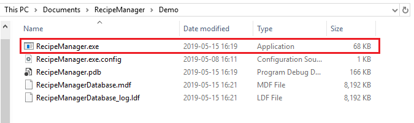
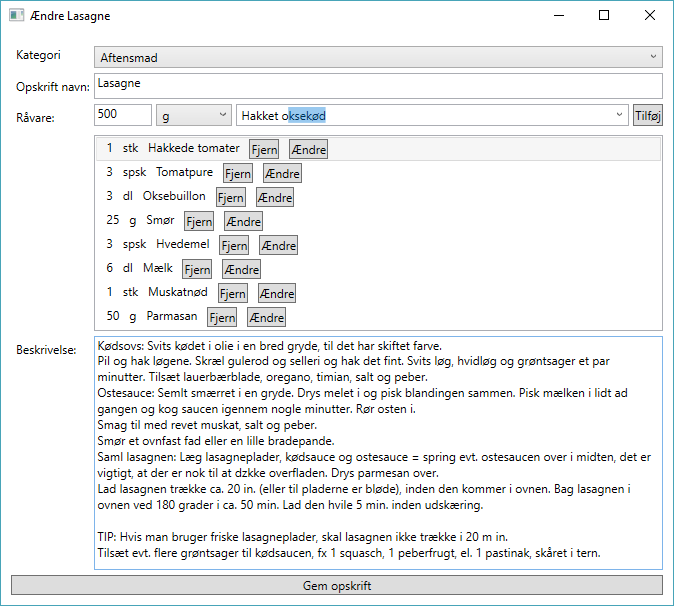

# Opskriftshåndteringssystem (RecipeManager)
## Hvad kan den?
* Gemme opskrifter.
  * Man kan manuelt oprette opskrifter.
  * Man kan tilføje opskrifter fra [valdemarsro.dk](https://valdemarsro.dk).
* Indele opskrifter i kategori.
* Slette opskrifter.
* Ændre i opskrifter.
* Og selvfølgelig browse opskrifter.

## Hvordan gør jeg?

1. Download eller hent dette repository.
1. Naviger hen til programmet, som set neden under og åbn den markerede fil:

1. Nu er programmet åbent, hvilket ses på billedet nedenunder. Her er opskriften **Lasagne** valgt fra kategorien **aftensmad**.

1. Hvordan laver jeg en kategori?
    * Klikker på den røde knap og udfylder formularen.
    * Klikken på den Orange top menu og vælger *Ny*  efter fulgt af *Kategori*.

1. Hvordan opretter jeg en opskrift?
    * Klikker på den grønne knap eller vælger *Ny* fra topmenuen, efterfulgt af *Opskrift*.
    * Nu kan du vælge mellem at oprette en opskrift manuelt eller fra link.
      * Fra link:
        1. Find den opskrift du gerne vil gemme, f.eks. [Pasta Arrabiata](https://www.valdemarsro.dk/pasta-arrabiata/).
        1. Tryk *Hent opskrift*. Opskriften vil nu blive hentet.
        1. Når opskriften er hentet ned, skal du bekræfte at alle ingredienser er aflæst korrekt. Hvis ikke kan du ændre i ingrediensens navn, mængde eller enhed. Tryk bekræft for at gå videre til den næste ingrediens og til sidst for at gemme opskriften.
        
      * Manuel
        1. Vælg kategori fra rullemenuen.
        1. Angiv et opskrift navn.
        1. Indtast mængden, enheden for en råvare. Begynd at skriv i tekst feltet for at finde en allerede oprettet råvare eller opret en ny, blot ved at skrive navnet færdig. Tilføj ingrediensen ved at trykke på *Tilføj*.
        1. Angiv en beskrivelse af opskriften og en fremgangsmåde.
        1. Til sidst gemmes opskriften ved at trykke på *Gem opskrift*.
        